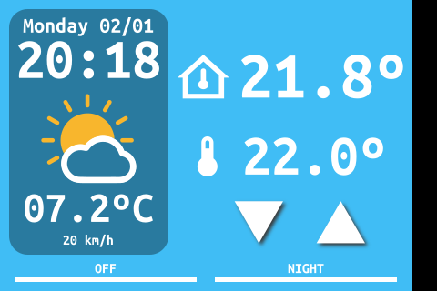
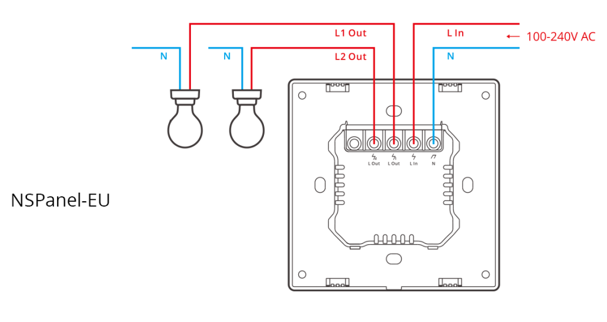

# NSPanel Thermostat

This is the configuration needed to run the Sonoff NSPanel with ESPHome firmware and custom Nextion TFT panel running as a thermostat for a home gas heating system.

It can also be used as a starting point for any other project using the NSPanel, in fact, **I would recommend using the NSPanel for anything but a thermostat!** As we will see later, this device has a couple of shortcomings that make it not particularly well suited to be used as a thermostat.

## Features

- Weather information and date/time on the display
- Internal NTC temperature display
- Changing target temperature manually on the display
- Two quick target temperatures; "home" and "away/night" that can be set manually
- Switch on or off the thermostat
- Auto sleep of the display (and a switch to turn on or off this feature)
- Brightness control from home assistant

# Notes about the hardware

The Sonoff NSPanel is a nice compact device that with custom firmware can be used for multiple home automation task or general user interface. Unfortunatelly it is not the best device to build a thermostat!

A thermostat is basically composed of a temperature sensor, a switch and a controller. From those three elements, the NSPanel has problems both on the sensor and the switches.

## Temperature sensor

The sensor is a NTC located in the bottom of the panel, poking through a small hole so it can probe fresh air. Unfortunatelly the heat from the device is enough to affect the reading.

With the screen switched off the temperature reading is at least 0.5ºC more than expedted, probably higher. With the screen at full brightness the error can increase to about 4ºC.

A way to correct this is to use an external sensor, something you may already have at home, like typical Zigbee temperature/humidity sensors. But if you go this route, know that these sensors are not developed to be used in control loops, they don't provide constant/predictible update intervals. Also the battery could die or have a problem in your Home Assistant that makes communication impossible. In this case you would need some way to detect this and avoid the thermostat getting stuck in a potentiallly dangerous situation.

Another way to fix the sensor issue is to modify the hardware so the sensor is slightly outside the enclosure. This way we maintain the whole control in one unit so it is less likely to fail... But this modification has risks in itself, you can damage your panel or have a bad solder that manifest later leading to the same issue of having the thermostat stuck in an open or close position.

You can find a more extensive information [here](hardware_mods.md) about what are the modifications required to improve the sensor readings.

## Switches

The NSPanel has both relays connected to Line from main's power. Beware, wiring this as it is to your gas boiler can cause damage to your boiler, NSPanel and burn down your entire house!

Sonoff clearly states in its webpage this device can be used as a thermostat, but doesn't provide any specific wiring diagram or use case.

Typical gas boilers don't expect to have Line connected to the thermostat contacts. Usually these are a potential free (or "dry") contacts that can be switched by a mechanical or battery operated thermostat.

This are the usual terminals you would expect to see in a wifi gas boiler thermostat:

Notice how the contacts 5 and 6 are not connected to the mains power terminals (3 and 4). This is how it should have been done, if the user needs to have them connected, it can be done by an external short wire. But having them connected in the first place is a big problem if an unaware user tries to connect it to the boiler.

This is what we have in the NSPanel:

Here we can see how both relays are marked as "L Out" and internally they are connected to the "L in" when the relays are closed.

It may be that other types of home heating systems (like radiant floor with electric valves) can be used directly with the NSPanel, but don't assume yours will work! Check first if the current thermostat switches main's voltage or is just a dry contact. If you don't know how to wire it, this may be better done by an electrician.

You can find a more extensive description [here](hardware_mods.md#user-content-relay-modification) as a reference on what is required to make the NSPanel switch a dry contact.

# Installation

To install this firmware you will first have to open your NSPanel and locate the communication pins, you can see [Blakadder's teardown](https://blakadder.com/nspanel-teardown/) for that.

Some people solder a pin header to those pins, but the space inside is quite tight and this process has to be done only once if done correctly, so I recommend just holding the cables with your finger so they make proper contact during the flashing process.

To put the ESP32 in bootloader mode the IO0 pin has to be connected to ground before powering up the device.

To flash the NSPanel use the [ESPHome-Flasher tool](https://github.com/esphome/esphome-flasher).

After the first flash, you will be able to update the device "over the air" so you can close the panel once you check it updates correctly.

You can also see how to do all the process in [Christopher Masto's video tutorial](https://www.youtube.com/watch?v=Kdf6W_Ied4o).

# ESPHome YAML file

You will need to edit the YAML file to match your particular Home Assistant configuration, specially the weather, external temperature and wind speed.

You can also choose to change the temperature sensor used to regulate the thermostat to an external sensor.

Beware that this will mean the thermostat is no longer "self conained", if your Home Assistant or you wifi fail your thermostat will no longer operate. This would lead to the contact being constantly open or constantly closed which could leat to a potentially dangerous situation.

It could be made that if the sensor is not updated in a certain time the thermostat reverts back to the internal sensor, gives an alarm and is switched to a safe state.

The YAML file is based in several other projects and, of course, a bit of my own development:

https://github.com/masto/NSPanel-Demo-Files/blob/main/nspanel-demo.yaml

https://github.com/gijsje/nextion-esphome/blob/master/nextion_extra.yaml

https://github.com/3ative/thermostat-project-v3/blob/main/ESPHome_thermostat_Code.yaml

# Nextion Editor

To modify the tft file you will need the [Nextion editor](https://nextion.tech/nextion-editor/).

The TFT has the following objects that can be interacted with by the ESP32:

|ID| Name    | Comment                     |
|--|---------|-----------------------------|
| 1| bg0     | background                  |
| 2| intTemp | internal temperature        |
| 3| extTemp | external temperature        |
| 4| time    | time                        |
| 5| setTemp | target temperature          |
| 6| btnUp   | increase target temperature |
| 7| btnDn   | decrease target temperature |
| 8| date    | date                        |
| 9| wind    | wind speed                  |
|10| weather | current weather             |
|11| btn0    | left button text            |
|12| btn1    | right button text           |

The current weather icon can be changed to the following states:

|ID| State           |
|--|-----------------|
| 3| clear-night     |
| 4| cloudy          |
| 5| fog             |
| 6| lightning       |
| 7| lightning-rainy |
| 8| partlycloudy    |
| 9| pouring         |
|10| rainy           |
|11| snowy           |
|12| sunny           |

The icons used for the current weather are slightly modified versions of the [Weather Color icon pack by Sihan Liu](https://www.iconfinder.com/iconsets/weather-color-2) who gives permission to edit/share/distribute.

## TFT screen in EU version

Both US and EU version use the same TFT screen with a resolution of 480x320, but you will have noticed that they have different sizes.

The visible resolution in the EU version is only about 452x320, this is because part of the screen is actually occluded by the bezzel and this is why the background image has a vertical black bar so the unused screen space doesn't distract the user trying to see under the bezzel.

## Display sleep

It seems that the ESPHome feature of 'touch_sleep_timeout' does not work properly (or I have not done it correctly) so instead I have set all the objects in the display to send a 'PRESS' event. This event can be read by ESPHome and trigger a sleep timeout, achieving the same functionality.
