# Hardware modification

**Warning:** this doesn't pretend to be a "how-to" guide, I just documented the process I followed and it may serve as reference for anybody else with enough technical knowledge and experience. A lot of these steps are difficult and dangerous to perform and the problems can manifest after several months working fine.

## Moving the NTC sensor outside the enclosure

Giving the constrains of the product I think the location of the NTC is good, in the bottom of the enclosure will get the least amount of heat, but unfortunately there is enough heat from the screen that makes its way to the NTC to cause quite a bit of error in the reading.

They can't sell a product that has a sensor with just two wires hanging out... but we can mod it! Just make sure nobody else touches or pulls on it... maybe this is not a mod for every household, so be mindful of that.

This is what the NTC looks from outside, notice how part of the NTC body is inside the plastic enclosure and how it is touching it so, even if plastic is a bad conductor of heat, in the end the screen heat reaches the NTC.

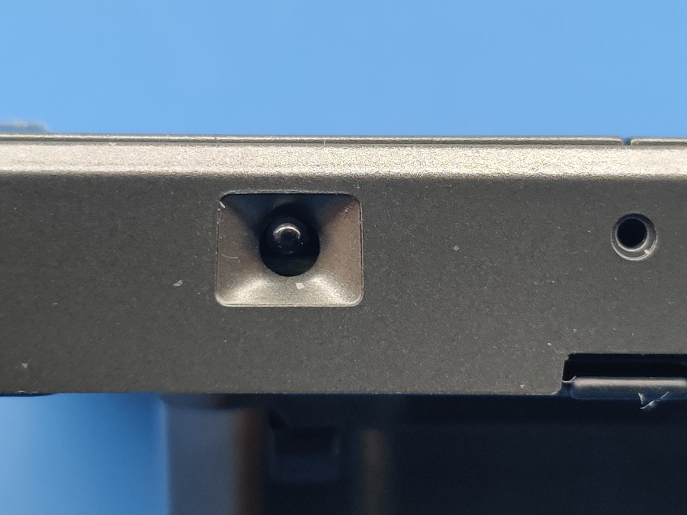

Be careful when removing the NTC, its much smaller than it seems in the picture, also when cleaning the PCB holes be careful not to damage the protection diode or the push button.

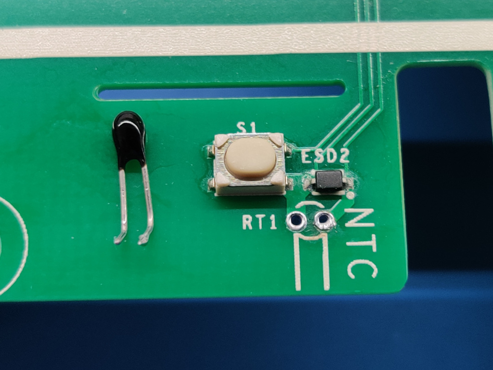

Use small gauge wires (AWG24 in the picture) to be able to extend the sensor connection to outside; 20 or 25mm should be enough.

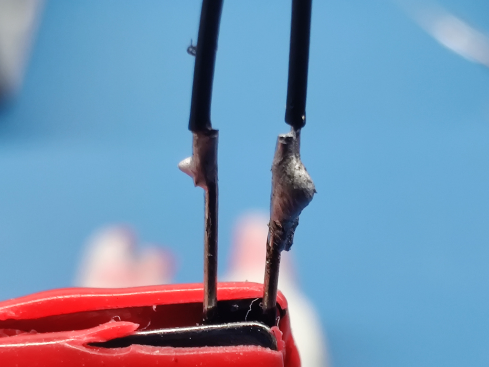

Use a small diameter shrink wrap to protect the wires from shorting out, this is important, if the sensor shorts out the thermostat won't operate.

Place the NTC in the hole and the PCB in place, solder both connections and cut the excess wire.

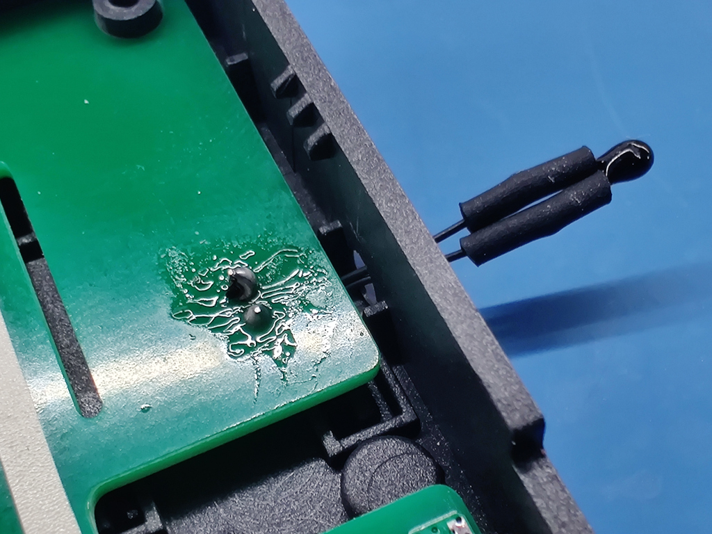

This is how the NTC looks now... not so slick and nice as before, but now it will read the correct temperature!

As previously said... this may not be a mod for everyone, you can have issues in the long term if the NTC becomes loose or if anyone is touching it. You may also think it just looks bad

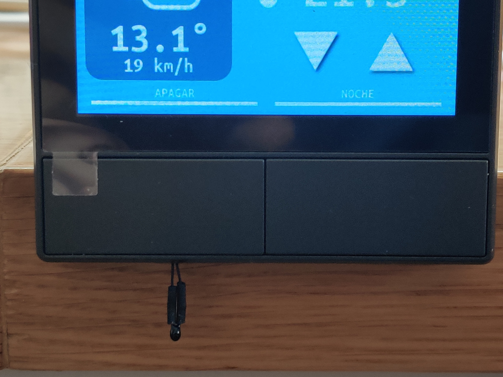

You can verify after a few minutes that the temperature reading is back to normal even with the screen at full brightness

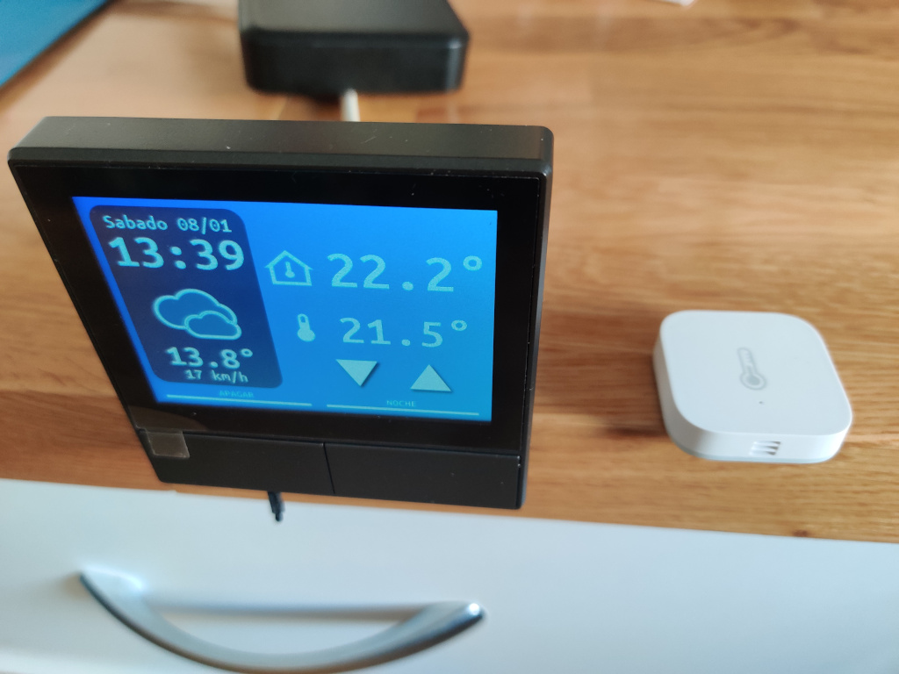

## Relay modification

**Warning, again:** here we are dealing with potentially lethal mains voltages, if you are unsure of these modifications don't modify your hardware! Even if a modified hardware seems to initially work fine, it can develop problems later than can result in fire or electrical shock.

The safer way to use the NSPanel as a thermostat is to use one of the relays to power an external relay or contactor, located in an electrical cabinet that switches the gas boiler on or off. This way you don't have to open or modify the device, but of course there is still a fair amount of electrical knowledge required and the installation of such relay should be better left to an electrician.

---

As can be seen in the picture below the Line trace goes to one terminal of each of the relays, by doing this they only need to provide one screw terminal for each relay and probably it's the reason why they didn't design the relays as free of potential.

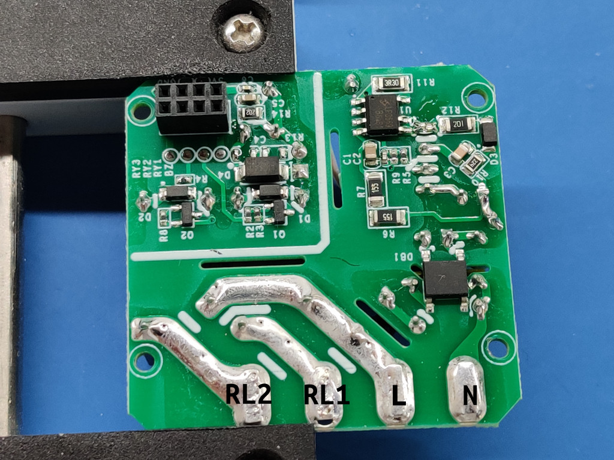

First step is to remove the relays and clean the vias and contacts. We will need to mount again one of them later

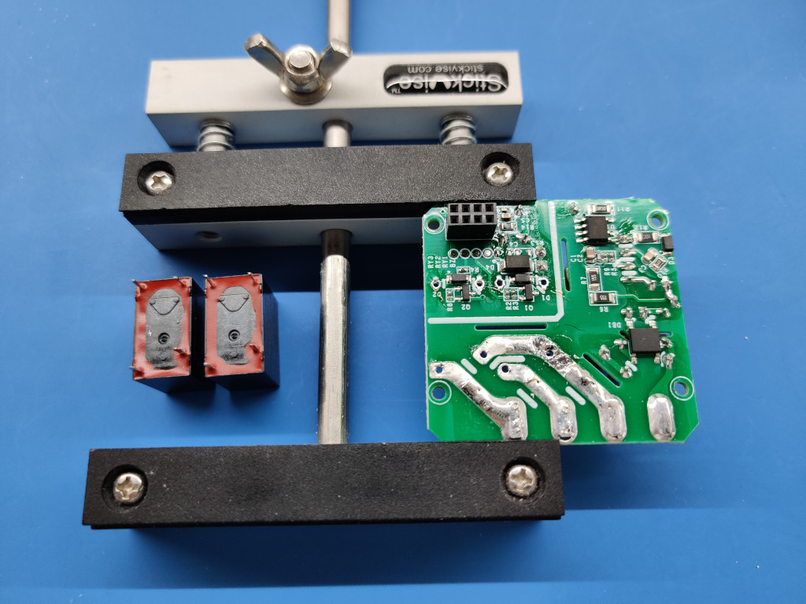

To isolate the relay the "Line" trace has to be completely cut out both in the bottom and top layers. The distance will need to be big enough so there is no danger of short circuit when the unit is powered.

The best way to do this is by using a rotary tool but beware, this will create a lot of fiberglass dust that is quite dangerous to inhale and copper dust that is conductive and could create a short circuit later.

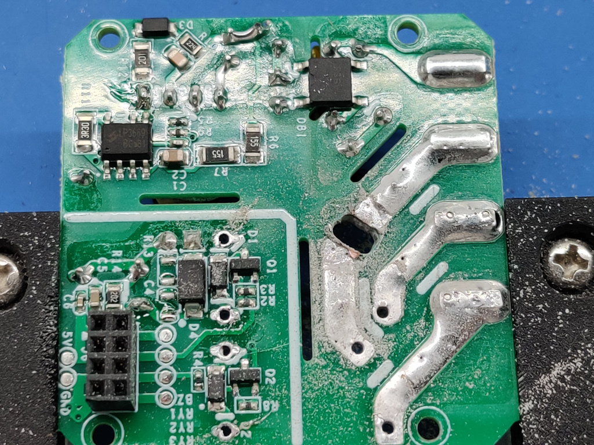

The circuit must be cleaned as best as possible, the two sides of the trace have to be completely isolated, so it is recommended to have an opening of 4mm or more, also the opening has to be wider than the trace itself in both sides. Make sure the edges of the PCB don't have any kind of metal shaving. Cleaning the edges with a razor blade is recommended.

This is the cut viewed from the top side, inspect and clean the cut in both sides. Use isopropyl alcohol to clean the PCB and all the dust.

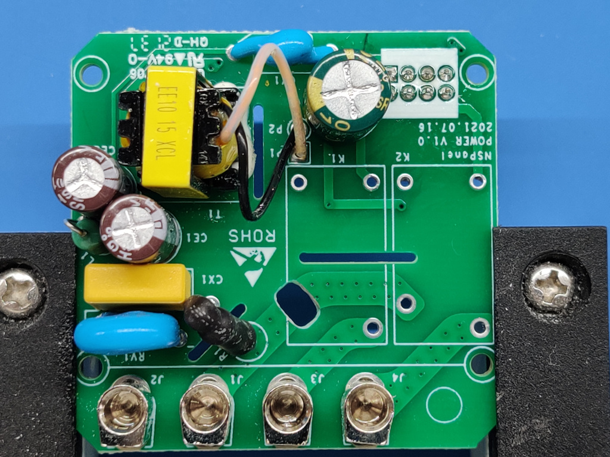

At this point one of the relays can be put again in place of K2 (the one near the edge). We also need to connect the other side of the relay, which we have now open, to the J3 terminal, we can do this by small length of wire as in the next picture.

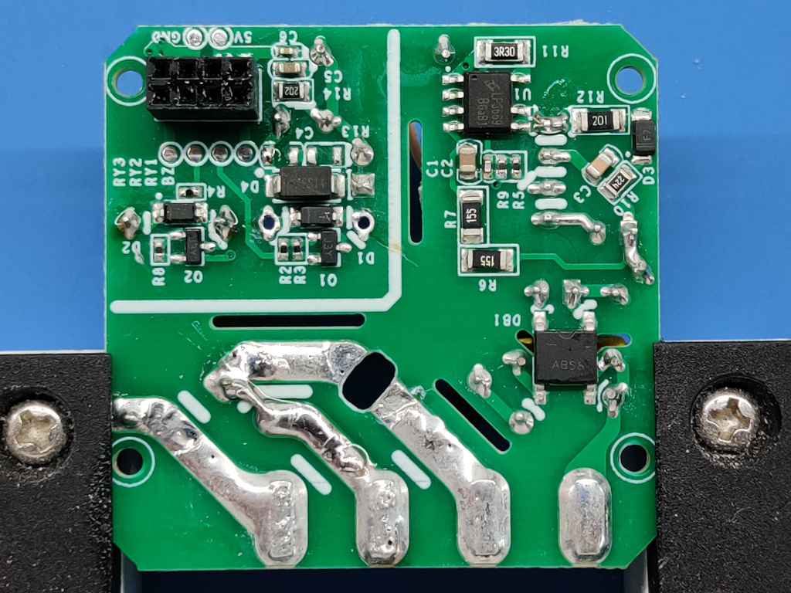

This is the view from the top side, cut the wire used for the jumper if needed so it doesn't protrude.

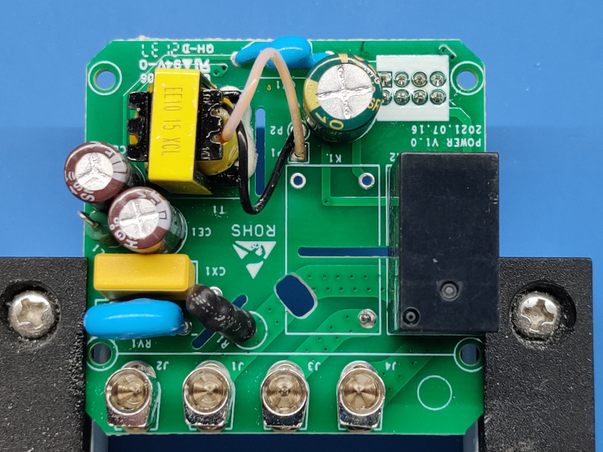

The only step remaining is re-assembly and testing!

